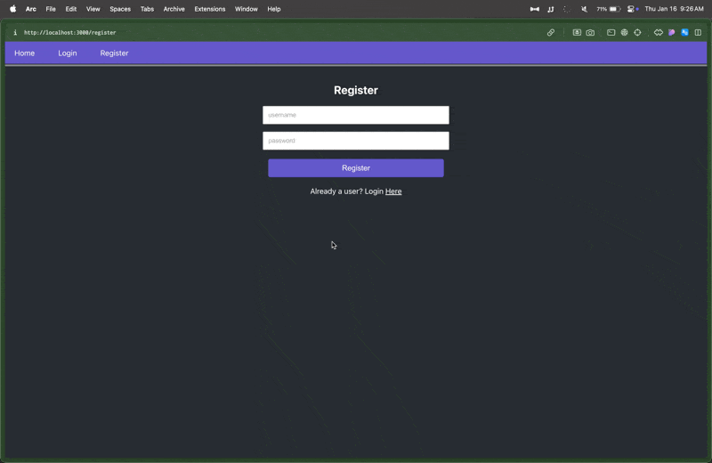

# About
Simple React / ExpressJS web application discussion board using MongoDB database. 

# Usage
After initializing both front-end and back-end:

1. `cd discussion-board`
2. `npm run start` 
3. `cd ..`
4. `nodemon server.js`
5. Start local MongoDB

# Features

## Login and Registration
Secure Registration and Logon through Bcrypt and JWT

## Post Creation and User Like Interaction
Discussions and comments stored in MongoDB as well as other data such as post likes and dislikes. 

## Security and Authentication

This application uses `bcrypt` and `jwt` for security and authentication.

### Bcrypt
Bcrypt ensures that even if the database is compromised, the passwords remain secure. The hashing is implemented in the [`userSchema.pre('save')`](models/User.js) middleware in the [User model](models/User.js).

### JWT (JSON Web Token)
When a user logs in, a token is generated and sent back to the client. This token is then included in the `Authorization` header of subsequent requests to protected routes. The token is verified using the `jsonwebtoken` library in the [auth middleware](middleware/auth.js).

### Implementation Details
- User registration and login routes are defined in the [auth routes](routes/auth.js).
- Password hashing is done using bcrypt in the [User model](models/User.js).
- JWT tokens are generated and verified in the [auth routes](routes/auth.js) and [auth middleware](middleware/auth.js).

